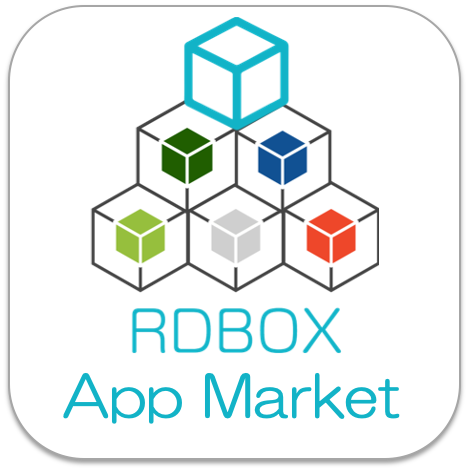
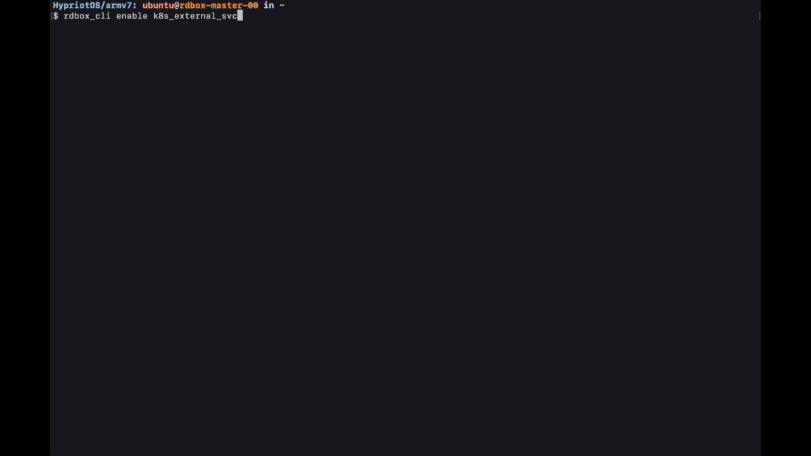
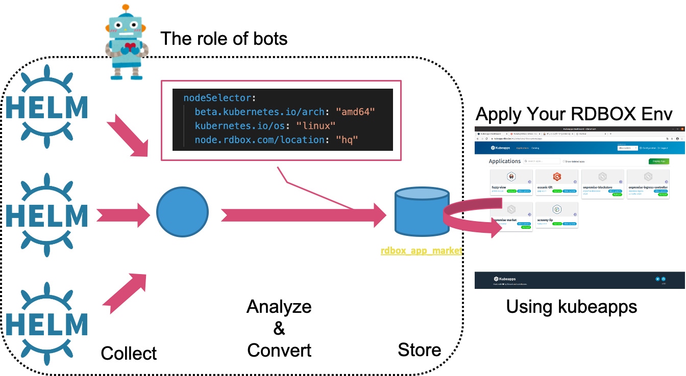

</img>

# RDBOX App Market

[](https://github.com/rdbox-intec/script_for_rdbox_app_market/actions?query=workflow%3A%22RDBOX+App+Market%22)

It is one of the core components of **[RDBOX (Robitics Developpers BOX)](https://github.com/rdbox-intec/rdbox)**.  

The RDBOX App Market is a platform to easily add highly integrates cloud-native and edge computing technologies applications to your RDBOX environment to help you develop service robots and IoT devices.  

This platform is backed by [Helm](https://helm.sh/) and [Kubeapps](https://kubeapps.com/) and [our smart BOT](https://github.com/rdbox-intec/script_for_rdbox_app_market).

## TL;DR

```bash
# 1. Enable RDBOX App Market(only once)
$ rdbox_cli enable k8s_external_svc
# 2. Open a browser and access Kubeapps using the obtained URL.
   "Kubeapps URL: https://kubeapps.rdbox.lan/"
```



## Feature

</img>

The biggest feature.

1. Collects third-party Helm chart repositories and adds settings adapted to the RDBOX environment.  
   - It automatically adds the best nodeSelector to the collected charts. This is a necessary consideration for RDBOX environments with a mixture of different CPU architectures such as amd64, armhf and arm64. The converted chart is available on the [rdbox\-intec/rdbox\_app\_market](https://github.com/rdbox-intec/rdbox_app_market)  

2. In addition to nodeSelector, the bot also automatically sets [Persistent Volumes](https://kubernetes.io/docs/concepts/storage/persistent-volumes/), [Ingress](https://kubernetes.io/docs/concepts/services-networking/ingress/), DNS, etc. that are provided as standard in the RDBOX environment.  

3. The charts we provide are not limited to automatically converted third party charts. It also includes [Helm charts we manage (rdbox\-intec/helm\_chart\_for\_rdbox)](https://github.com/rdbox-intec/helm_chart_for_rdbox). The RDBOX App Market also provides charts for directly moving service robots and IoT devices and charts that are difficult to automatically convert.  

## Requirements

The completed **[RDBOX (Robitics Developpers BOX)](https://github.com/rdbox-intec/rdbox)** environment.  
However, it is also possible to use the Helm charts provided here in the general Helm environment.

```bash
# third-party Helm chart
$ helm repo add rdbox-bot https://rdbox-intec.github.io/rdbox_app_market/bot-gen
$ helm search repo rdbox-bot
$ helm install ${RELEASE_NAME} rdbox-bot/${CHART_NAME}

# Helm charts our managed
$ helm repo add rdbox-manually https://rdbox-intec.github.io/rdbox_app_market/manually
$ helm search repo rdbox-manually
$ helm install ${RELEASE_NAME} rdbox-manually/${CHART_NAME}
```

## Documentation

[For more information on how to use it, click here: ./docs](https://github.com/rdbox-intec/rdbox_app_market/tree/master/docs)

## Referred to

### third-party

- [bitnami/charts](https://github.com/bitnami/charts)
- [helm/charts](https://github.com/helm/charts)
  - stable
  - incubator

### Created by us manually (Your PR is welcome.)

- [rdbox\-intec/helm\_chart\_for\_rdbox](https://github.com/rdbox-intec/helm_chart_for_rdbox)

---

---

## **NOTICE**

Our bot is not perfect. The bot cannot change all settings correctly.  
When applying a convenient app to your RDBOX environment, **please check the settings yourself.**  

## Licence

Licensed under the [Apache License, Version 2.0](/LICENSE) license.
